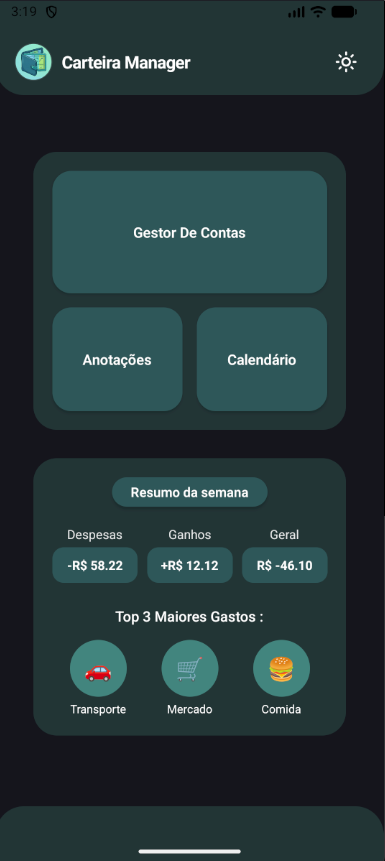
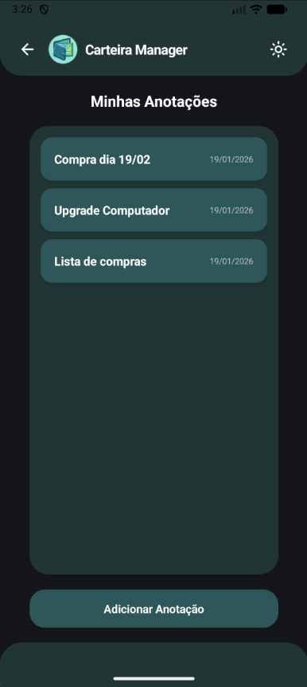
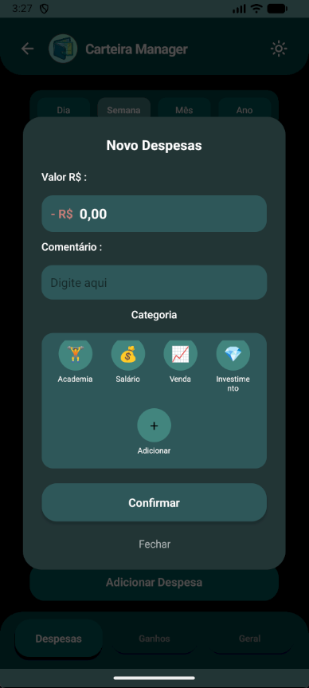
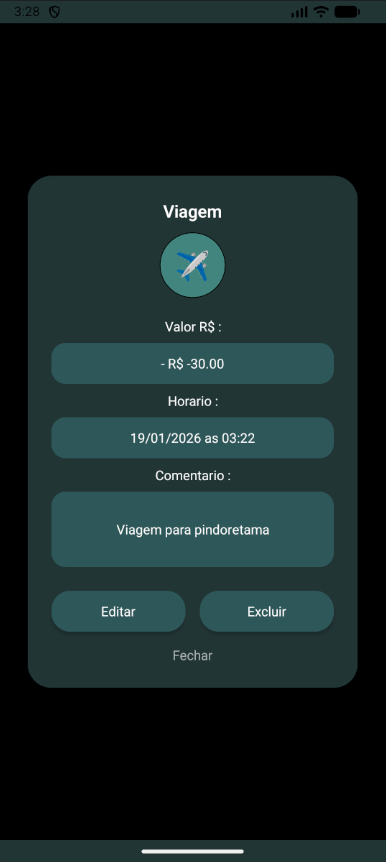
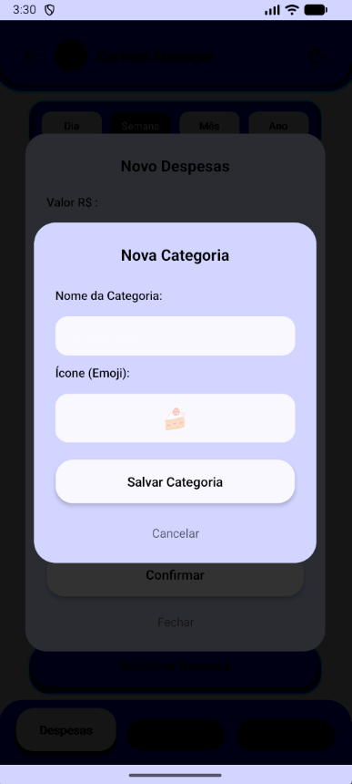

# 💰 CarteiraManager

**CarteiraManager** é um ecossistema de produtividade pessoal desenvolvido com **React Native**. O projeto une um gestor financeiro robusto com um bloco de notas integrado e calendário interativo, focado em privacidade, performance offline e uma experiência de usuário fluida.

---

## 🛠️ Tecnologias Usadas

O projeto foi construído utilizando as tecnologias mais modernas do ecossistema mobile:

* **Framework:** [React Native](https://reactnative.dev/) com [Expo](https://expo.dev/)
* **Linguagem:** [TypeScript](https://www.typescriptlang.org/) (Segurança de tipos e manutenibilidade)
* **Banco de Dados:** [SQLite](https://www.sqlite.org/index.html) via `expo-sqlite` (Persistência local robusta)
* **Visualização de Dados:** [React Native Gifted Charts](https://github.com/Abhinandan-Kushwaha/react-native-gifted-charts)
* **Ícones:** [Lucide React Native](https://lucide.dev/)
* **Navegação:** [Expo Router](https://docs.expo.dev/routing/introduction/) (Navegação baseada em arquivos)

---

## ✨ Features

O app oferece uma solução completa para organização pessoal através das seguintes funcionalidades:

* **Gestão Financeira:** Controle detalhado de ganhos e despesas com categorização customizável.
* **Dashboard Visual:** Gráficos interativos para análise de saúde financeira em tempo real.
* **Bloco de Notas:** Sistema de anotações integrado para registro rápido de ideias e lembretes.
* **Calendário Interativo:** Visualização de eventos e transações organizados por data.
* **Personalização de Interface:** Suporte completo a temas dinâmicos (**Dark e Light Mode**).
* **Operação Offline:** Funcionamento total sem dependência de nuvem, garantindo privacidade e velocidade.

---

## 🏗️ Processo de Desenvolvimento 

A motivação para desenvolver esse app surgiu da necessidade de uma ferramenta de produtividade que respeitasse a **privacidade dos dados** do usuário, mantendo tudo processado localmente.

 utilizei este projeto para aplicar conceitos avançados de engenharia:
* **Performance:** Implementação de **Memoização** (`useCallback`, `useMemo`) para evitar re-renderizações desnecessárias em listas grandes.
* **Arquitetura de Dados:** Uso de banco de dados relacional com modo **WAL (Write-Ahead Logging)** no SQLite para garantir que operações pesadas não travem a interface.
* **Gerenciamento de Estado:** Orquestração de temas e estados globais via **Context API**.

O objetivo foi criar uma arquitetura escalável que pudesse servir como portfólio de boas práticas em desenvolvimento mobile multiplataforma.

---

## 🚀 Como Rodar o Projeto

Atualmente, o projeto está disponível para dispositivos Android. Para testar:

1.  Acesse a aba [Releases](https://github.com/seu-usuario/CarteiraManager/releases) do repositório.
2.  Baixe o arquivo `.apk` da versão mais recente.
3.  Instale no seu dispositivo Android (pode ser necessário permitir a instalação de fontes desconhecidas).

Para desenvolvedores que desejam rodar o código:
```bash
# Instalar dependências
npm install

# Iniciar o Expo
npx expo start
```
---

## 📸 Screenshots

Abaixo, a demonstração visual das principais funcionalidades do app. 

| :---: | :---: | :---: |

| Home Dashboard | LightMode | Gestor Despesas |

|  |  |  |

| **Gestor Geral** | **Gestor Ganhos** | **Anotacoes** |

|  |  |  |

| **PopUp Conta** | **Calendario** | **Calendario cards** |

|  |  |  |

| **Detalhes card** | **Adicionar categoria** | **Adicionar anotacao** |

|  |  |  |


---

## 👨‍💻 Autor


**Kaynan Santos**

Estudante de Ciência da Computação na Universidade Estadual do Ceará (UECE). 


